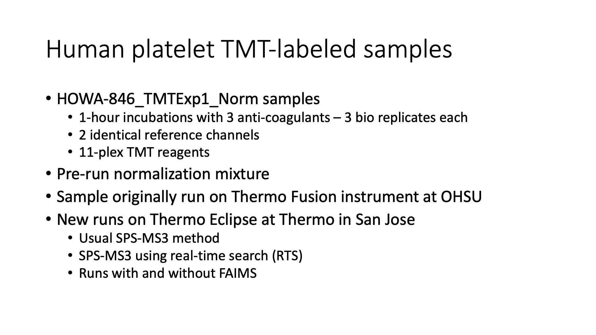
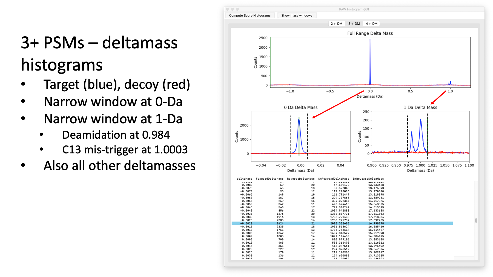
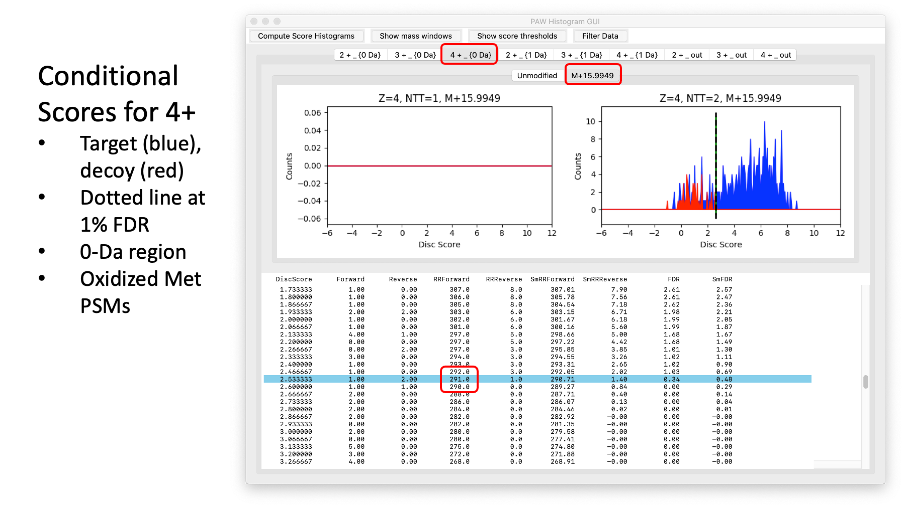

# Eclipse_to_Fusion_comparison
A comparison of one sample on a Thermo Fusion to a new Thermo Eclipse (with RTS in the mix).

---

# Comparison between Fusion and Eclipse  (with and without RTS)

## Human Platelet Anticoagulant Study

### Samples from Samuel Tassi Yunga, CEDAR, OHSU

### Sample processing and Fusion TMT data by Ashok Reddy, PSR Core, OHSU

### Eclipse TMT data generation by Joshua Nicklay, Thermo, San Jose

### Data analysis performed by Phil Wilmarth, PSR Core, OHSU

#### May 17, 2020

---

_Slide 1_ 
Analysis of an 11-plex TMT labeled human platelet sample from OHSU Proteomics Core. Two-hour LC runs performed at OHSU for Fusion and at Thermo Finnegan in San Jose, CA for Eclipse.

---

_Slide 2_ 
The human platelet samples were prepared by Dr. Ashok Reddy and analyzed at Thermo by Joshua Nicklay. The new data was collected on an Eclipse Oribtrap Tribrid using the SPS MS3 method in combination with real-time search (RTS) and with a FAIMS front end. Sample loading and a 2-hour reverse phase gradient was used to mimic original data generated at OHSU using our older Thermo Fusion Tribrid instrument. The new data was a simple SPS MS3 run (similar to what the Fusion can do). There was also a run using the real time search acquisition mode (RTS) to see if better sensitivity could be obtained. Both plain SPS MS3 and RTS SPS MS3 were also done with and without front end FAIMS filtering (that data is not presented here).

> [first RTS paper](https://pubs.acs.org/doi/10.1021/acs.jproteome.8b00899) Erickson, B.K., Mintseris, J., Schweppe, D.K., Navarrete-Perea, J., Erickson, A.R., Nusinow, D.P., Paulo, J.A. and Gygi, S.P., 2019. Active instrument engagement combined with a real-time database search for improved performance of sample multiplexing workflows. Journal of proteome research, 18(3), pp.1299-1306.

> [second RTS paper](https://pubs.acs.org/doi/10.1021/acs.jproteome.9b00860) Devin K. Schweppe, Jimmy K. Eng, Qing Yu, Derek Bailey, Ramin Rad, Jose Navarrete-Perea, Edward L. Huttlin, Brian K. Erickson, Joao A. Paulo, and Steven P. Gygi, 2020. Full-Featured, Real-Time Database Searching Platform Enables Fast and Accurate Multiplexed Quantitative Proteomics. Journal of proteome research, 19(3), pp.2026−2034.

---

_Slide 3_ 
The 5 RAW files were processed at San Jose using Proteome Discoverer (results not shared). The RAW files were also processed at OHSU using the [Comet/PAW pipeline](https://github.com/pwilmart/PAW_pipeline).

---

_Slide 4_ 
The Comet/PAW pipeline uses Comet for the database searching. Post search processing and FDR analysis is done with a series of Python scripts in the PAW pipeline. Accurate mass measurements from the high resolution Oribitraps are used correctly to increase PSM identification sensitivity. A discriminant score transformation, similar to PeptideProphet, and the target/decoy method are used as an efficient static classifier for correct and incorrect matches. Basic and extended parsimony principles are used to provide the best context for quantitative analysis from shotgun proteomics data. TMT reporter ions are extracted and aggregated in ways that facilitate proper normalization and maximize quantitative information.

---

_Slide 5_ 
Accurate mass differences between measured MH+ values and the calculated MH+ values from the top PSM matches are histogrammed from wide tolerance searches (typically 1.25 Da). Most correct matches (blue histograms) are concentrated in a peak at 0-Da. There are smaller peaks at 0.984 Da (deamidation) and 1.003 Da (first isotopic peak). Narrow windows to capture the single peak at 0-Da and the two peaks at 1-Da are set. Those define two peptide deltamass classes. All other deltamasses not in inside the two narrow windows make up the third deltamass class. These are the histograms and the window settings for the 2+ matches. The deltamasses for decoy matches are the red histograms.

---

_Slide 6_ 
These are similar histograms and windows for the 3+ matches.

---

_Slide 7_ 
These are similar histograms and windows for the 4+ matches.

---

_Slide 8_ 
The discriminant scores for target matches (blue) and decoy matches (red) are overlaid in conditional score histograms. A table of FDRs as a function of discriminant score is also shown to guide score cutoff (the dotted line) selection to achieve the desired FDR. In addition to the three deltamass classes (0-Da, 1-Da, and outside windows), scores are separated by peptide charge state (2+, 3+, and 4+) and by variable modification state (unmodified peptides and peptides with an oxidized methionine). These are the scores for for the 0-Da deltamass, 2+ charge, unmodified peptides. The dotted line is a 1% FDR cutoff. We have 14,416 target matches above this score cutoff.

There is also another separation by number of tryptic termini (NTT). We specified only fully tryptic peptides for this Comet search, so we do not have any semi-tryptic peptide scores (the left histogram plot window).

---

_Slide 9_ 
These are the scores for the oxidized met 2+ peptides with a 0-Da deltamass.

---

_Slide 10_ 
These are the scores for unmodified 3+ peptides with a 0-Da deltamass. We have very few decoy matches for the 0-Da windows.

---

_Slide 11_ 
These are the scores for the oxidized met 3+ peptides with a 0-Da deltamass.

---

_Slide 12_ 
These are the scores for the unmodified 4+ peptides with a 0-Da deltamass. We do not have many 4+ peptides with trypsin.

---

_Slide 13_ 
These are the scores for the oxidized met 4+ peptides with a 0-Da deltamass.

---

_Slide 14_ 
The small 1-Da deltamass region is up next. These are the scores for the unmodified 2+ peptides with a 1-Da deltamass. We lump together the two peaks to get better statistics and to try and keep the number of histograms more manageable.

---

_Slide 15_ 
These are the scores for the oxidized met 2+ peptides with a 1-Da deltamass.

---

_Slide 16_ 
These are the scores for the unmodified 3+ peptides with a 1-Da deltamass.

---

_Slide 17_ 

These are the scores for the oxidized met 3+ peptides with a 1-Da deltamass.

---

_Slide 18_ 
These are the scores for the unmodified 4+ peptides with a 1-Da deltamass.

---

_Slide 19_ 
These are the scores for the oxidized met 4+ peptides with a 1-Da deltamass.

---

_Slide 20_ 
There are often correct matches that do not have accurate deltamasses. What fraction of the data might fall into this category depends on a lot of factors including the instrument method. These matches would be lost with narrow parent ion mass tolerance (10-20 ppm) search settings. These are the unmodified 2+ peptides that did not have a deltamass inside either the 0-Da window or the 1-Da window.

---

_Slide 21_ 
These are the oxidized met 2+ peptides that did not have a deltamass inside either the 0-Da window or the 1-Da window.

---

_Slide 22_ 
These are the unmodified 3+ peptides that did not have a deltamass inside either the 0-Da window or the 1-Da window.

---

_Slide 23_ 
These are the oxidized met 3+ peptides that did not have a deltamass inside either the 0-Da window or the 1-Da window.

---

_Slide 24_ 
These are the unmodified 4+ peptides that did not have a deltamass inside either the 0-Da window or the 1-Da window.

---

_Slide 25_ 
These are the oxidized met 4+ peptides that did not have a deltamass inside either the 0-Da window or the 1-Da window. Collectively, we recovered a little over 1,000 additional target matches (from 5 LC runs) from this "outside windows" deltamass peptide class.

---

_Slide 26_ 
The original Fusion data from this single LC run was re-processed with the same parameters that were used for the Eclipse processing.

---

_Slide 27_ 
These are the data processing summary statistics for the three platform/methods being compared. Complicated methods like SPS MS3 have many parameters that affect cycle times and data signal-to-noise. We had fewer acquired MS2 scans in a 2-hour run with our Fusion settings. However, we had a pretty high identification rate of 47%. The real time search skips the time consuming MS3 scan in the Orbitrap for MS2 scans that should not yield confident PSMs. This frees up the instrument to acquire more scans in a given time. Despite the vote of confidence from the real time search scoring, we had the lowest ID rate for the Eclipse with RTS.

The point of TMT experiments is not just identification but also quantification. The bar is higher for quantitative data than for identification data. The PAW pipeline tests individual MS3 scans against a low intensity cutoff. A trimmed mean is computed and tested. If the test fails, the reporter ions for than scan are zeroed out. The MS2 scan is retained for identification and protein inference reasons. This means not every scan passing the FDR cutoff will have reporter ion signals. For the RTS data, the MS2 scans that did not trigger an MS3 scan are also in the data mix. Not all scans with reporter ions are usable for quantification in shotgun experiments. Peptides that map to multiple proteins (in the proper context) have ambiguous information content and cannot be used. We routinely use minimally redundant UniProt canonical reference protein databases and employ an extended parsimony protein grouping step to maximize the usable peptides for quantification. The last column of the bottom table are the final numbers and the most accurate for comparisons between platform/methods.

---

_Slide 28_ 
I find the PSM counts to be the best numbers to use to see the differences. We are usually reporting proteins but how a given number of PSMs produce a list of proteins depends on many factors beyond the instrument performance; such as, type of samples, the types of proteins in the samples, organism being studied, choice of protein database, protein inference algorithm, and any protein ranking/cutoff heuristics. As mentioned, we need to keep PSMs that do not have sufficiently intense reporter ions to correctly infer the proteins. When we count peptides and proteins, those numbers are based on all PSMs. The PAW pipeline does not track quantifiable proteins per se. I did make some effort to count those for the last column in this analysis.

---

_Slide 29_ 
The intensities of individual reporter ions depend on many things: sample load, instrument tune, instrument cleanliness, HPLC performance, data acquisition settings, etc. This TMT labeling includes two identical reference channels (it was part of a larger 2-plex experiment). We will use those later to perform internal reference scaling (IRS) and get all of the data on a common scale. We can look at the general magnitude of the reporter ions before any normalizations to see how the data differ. We see lower intensity values for the Fusion, as might be expected. Interestingly, we have the largest values for the plain SPS MS3 method on the Eclipse. Without detailed instrument setting, it is hard to know if this has any significance. Different AGC targets or ion fill times might have been used.

---

_Slide 30_ 
One of the benefits of isobaric labeling is the reproducibility of the measurements. Technically, that is only true if the data is processed correctly. There are multiple normalization steps involved in these analyses and the natural reporter ion intensity scale need to be kept. When all of that is done correctly, the the distribution of protein CVs by biological condition is an excellent performance metric. Here we have the CV distributions for the 3 anticoagulants by platform/method. The higher sensitivity Eclipse Orbitrap Tribrid compared to the Fusion is reflected in higher quality reporter ion signals. The median CVs and spread in the CV distributions are improved for the Eclipse. The real time search method seems to further improve the data.

---

_Slide 31_ 
We know that the choice of anticoagulant did not change protein expression very much. We can lump all the anticoagulant data together and compute an overall CV distribution by platform/method. The difference between the Fusion and the newer Eclipse is now a little more obvious.

---

_Slide 32_ 
Here are the median CVs (%) associated with the distributions in the previous two slides. These are three different human biological subject samples; these are not cell cultures. Platelets, with careful preparation, have rather low CVs compared to other human subject samples that we have worked with over the years in the OHSU core. These are all SPS MS3 measurements, so the CVs are not small because of compressed dynamic range for reporter ions that is present in MS2-based methods.

---

_Slide 33_ 
We can use multi-panel scatter plots to see how similar each biological replicate is. These are the ACD anticoagulant samples for the three platform/methods.

---

_Slide 34_ 
These are the EDTA anticoagulant samples for the three platform/methods.

---

_Slide 35_ 
These are the Heparin anticoagulant samples for the three platform/methods. In all anticoagulants, we have more scatter in the Fusion data, particularly for low intensities. The platelets from one subject (S3) had some different response to heparin that was not seen in the other two anticoagulants. Subjects S1 and S4 had very similar intensities (lower left scatter plots in the above panels).

---

_Slide 36_ 
Statistical testing was done to compare the anticoagulants to each other. This does not make any sense for this pre-run sample. The original experiment performed at OHSU used 18 first dimension fractions in a scaled-up experiment with two 11-plexes. Over 3000 proteins were profiled in that experiment (complete analysis in progress). Here we are mostly qualitatively comparing plots between platform/methods. These are the data from the ACD and EDTA samples (at 1-hour).

---

_Slide 37_ 
These are the data from the ACD and Heparin samples (at 1-hour).

---

_Slide 38_ 
These are the data from the EDTA and Heparin samples (at 1-hour). For this limited experiment, we do not have many, if any, real differential expression changes. We have one heparin treated sample with some proteins that changed in abundance. That alters some average protein expression levels and that comes with some high variance. We have a few proteins with more than 2-fold expression changes, but most are not statistically significant.

---

_Slide 39_ 
Internal reference scaling makes the most sense conceptually to take data acquired on one instrument at one time from multi-plexes and combine them into one seemingly larger plex experiment. However, the same channels in a TMT plex are still the same samples no matter what instrument is used or when it was used. We can actually combine the OHSU Fusion data with the San Jose Thermo Eclipse data using the pooled reference channels. This puts all three platform/method datasets on the same intensity scale for direct comparisons. We see that the intensity distributions are very well matched after IRS and TMM normalization, with the boxplots all in excellent horizontal alignment. Keep in mind that all scaling of the 9 biological samples in each of the three datasets were independent. The scaling of each plex was based only on the common reference channels. We can check how the samples cluster. The two Eclipse datasets are nearly identical (blue and green). There is more spread in the Fusion data and it is not as similar to the Eclipse data as the two Eclipse runs are to each other. The Fusion is to the left (red) and the Eclipse data are to the right (blue/green). The top-to-bottom pattern is similar between both instruments. S3 heparin is at the top and S1 ACD is at the bottom.

---

### 
 Direct comparison of the 3 datasets 

_Slide 40_ 
We know from many of the previous slides that these 9 biological samples are not very different from each other. We can average the intensities for all nine samples for each platform/method and compare that by platform/method (this gives us nice large plots). This is pretty amazing. We have data from two different Orbitrap Tribrid instruments (two generations apart). We have two labs (OHSU and Thermo San Jose), we have two LC systems, we have two different technicians, we have two different dates, and we have two different data acquisition methods (for the Eclipse instrument). The Eclipse data is superb. The Fusion data has some warts but is still surprisingly good. The Fusion was a pretty successful first-generation instrument. The degree of complexity in these instruments is quite high. Adding the additional complexity of the real time search to the complexity of the Tribrids did not give me much confidence before starting this analysis. I have to say that I think the real time search works well.

> I am not very susceptible to manufacturer and major lab hype for these sorts of things. I see minor to major flaws in almost every published paper I read these days (I know, I am old and cranky). I don’t believe anything until I test it.

---

_Slide 41_ 
I expected a new instrument to outperform a six-year-old instrument and that was the case. We knew that the Fusion was less sensitive for the multi-stage isolations and we have compensated with scaled up experiments (always 9 to 18 fractions). Real time search actually works, and the RAW files are almost the same as from the regular SPS MS3 method. We did not see anything approaching a factor of 2 improvement, at least not for this sample. There was about a 9% gain compared to the regular SPS MS3 method on the Eclipse. Median CVs and data scatter were better with RTS, and the proteome sampling depth was quite a bit better. There are many comparison metrics to consider simultaneously to get an accurate picture of the similarities and differences.

---

Thank you!
